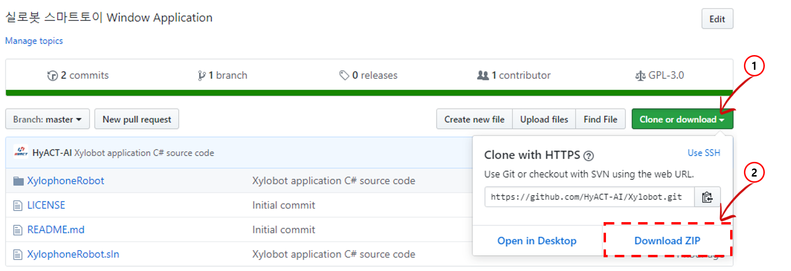
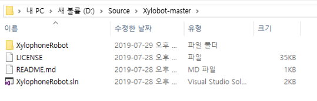
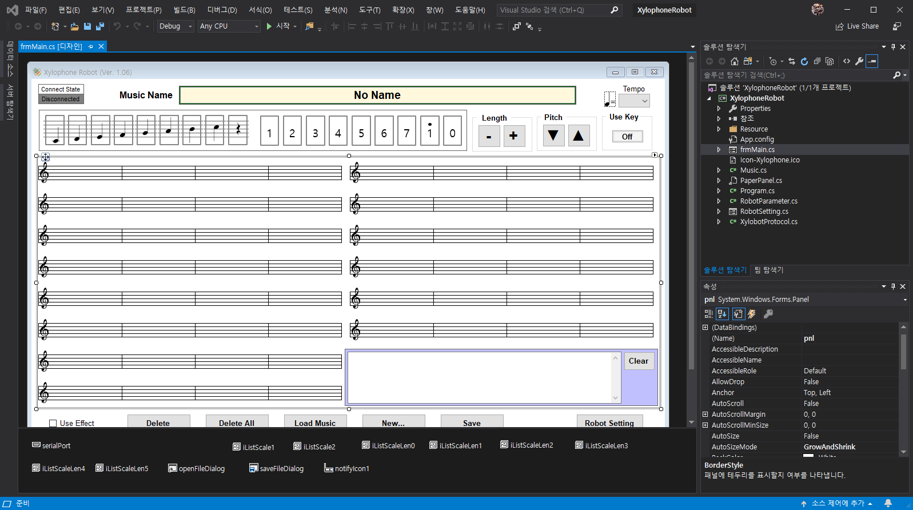
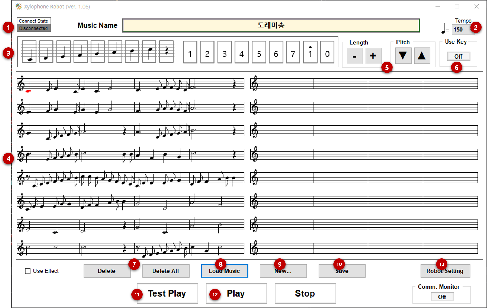
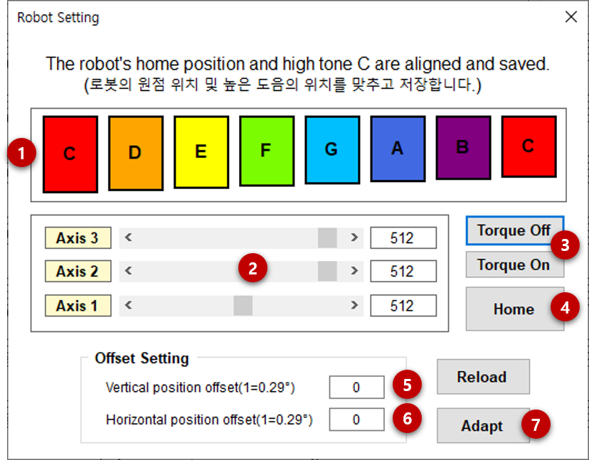
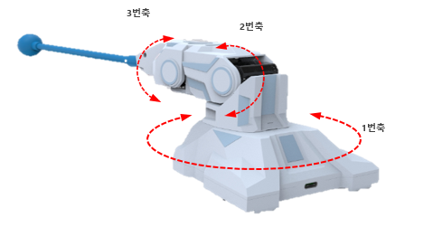
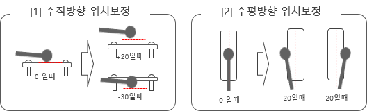

<a href="http://hyact.net/">
    
</a>

# Xylobot


* 실로폰을 연주하는 스마트토이 로봇인 [실로봇(Xylobot)](http://www.hyact.net/_kr/store/gds_intro.php)을 
윈도우 환경에서 사용할 수 있는 **C# 기반 어플리케이션 소스 코드**를 제공합니다.  

> *Xylobot 소스코드를 통해 실로폰에서 음악을 연주하기 위해서는 스마트토이 실로봇(Xylobot)을 
[**HyACT Homepage**](http://www.hyact.net/_kr/store/store.php)에서 구매하여 PC와 연결하세요.*

### 소개영상  

[](https://youtu.be/ZDZSIKRVAvE "Xylobot 소개 영상 - Click to Watch!")

## Table of content

- [개발 환경 만들기](#개발-환경)
- [프로젝트 실행하기](#프로젝트-실행하기)
- [주요기능 설명](#주요기능-설명)
    - [메인 화면](#frmMain)
    - [설정 화면](#RobotSetting.cs)


## 개발 환경

Xylobot은 **Microsoft Window10**에서 동작하는 **C#** 언어로 개발되어 있습니다  

* **Window 10** 이 설치되어 있는 PC 또는 노트북
* [**Visual Studio Community 2019**](https://visualstudio.microsoft.com/ko/vs/community/) 설치
    * Visual Studio Community 2017 도 사용 가능합니다.
```
Visual Studio Community 2019 은 Visual Studio 공식 홈페이지를 통해 내려받아 설치하실 수 있습니다. 
상업적 용도가 아닌 개인 개발자, 학교, OSI가 인정한 오픈소스 커뮤니티, 비영리적인 목적으로 사용하는 경우에는 
조직 규모나 별다른 제약 사항이 없기에 누구나 사용할 수 있습니다. 
상업적 용도로 사용하고자 하는 기업의 경우에 한해 따로 명시된 규정을 따라야 합니다. 
상업용으로 사용하다가 발생하는 불이익에 대해서는 본인이 책임져야 합니다.
```

## 프로젝트 실행하기

1. 상단의 **Clone or downloaded**를 눌러 나오는 화면에서 **Download ZIP** 을 선택하여 소스 코드를 다운로드 합니다.
<p align="left">
  
</p>  

2. 다운로드 한 파일을 적당한 위치에 압축 해제합니다.
<p align="left">
  
</p>  

3. XylophoneRobot.sln 파일을 실행하여 Visual Studio Community 2019를 실행합니다.  
Visual Studio Community 2019를 먼저 실행하고 프로젝트 또는 솔루션 열기에서 XylophoneRobot.sln 을 선택해도 됩니다.  

4. Visual Studio 화면에 XylophoneRobot 프로젝트가 로드 됩니다.  
<p align="left">
  
</p>

## 주요기능 설명

This document is for the Xylobot **1.06 release and later**.

### frmMain.cs

<p align="left">
  
</p>  

```
1. 실로봇과 연결상태 표시
   (1) 녹색 : 정상연결됨
   (2) 회색 : 연결 안됨 
2. 연주 속도 설정 : 5단계 (우측 그림 참조)
3. 음계 및 쉼표 입력 : 클릭하여 악보에 음계 및 쉼표 추가
4. 악보 표시 영역 : 음계를 표시하며, 클릭하면 음계가 선택됨
5. 음계 길이/높이 설정 : 선택된 음계 및 쉼표의 길이/높이(쉼표는 제외)를 변경함
6. 숫자 키보드 사용 설정 : 숫자 1~9, 방향키를 사용하여 음계/쉼표를 입력할 수 있음
7. 삭제/모두삭제 : 선택된 음계를 삭제 또는 입력된 모든 음계를 삭제함
8. 음악 불러오기 : PC에 저장된 음악을 불러와서 악보표시 영역에 표시함. (편집할 수 있음)
9. 새로 만들기 : 음악을 새로 만들기 시작함. 편집중인 모든 악보는 삭제됨
10. 저장하기 : 편집중인 음악을 PC에 파일로 저장함
11. 테스트 연주 : 선택된 음계에서 부터 연주를 시작함
12. 연주 시작 : 음악의 처음부터 연주를 시작함
13. 설정화면 열기 : 실로폰 연주의 정확한 위치를 설정하는 설정 화면을 표시함  
```

### RobotSetting.cs

* Xylobot 회전축의 방향과 위치 값 조절  

<p align="left">
  
</p>  
  
1. 단음 연주 : 음을 클릭하면 해당 음을 연주함  
2. 축별 개별 조종 : 각각의 축별로 스크롤바를 움직여 개별로 조종해 볼 수 있음  
    (※ 축번호는 아래 그림 참조)  

<p align="left">
  
</p>    

    - 1번축 : 실로봇 가장 아래 좌/우 회전축  
    - 2번축 : 1번축(회전축)과 연결된 상/하 회전축  
    - 3번축 : 2번축과 연결된 실로폰 채와 연결된 상/하 회전축  
    
3. 토크 설정    
   설정(On) : PC가 실로봇을 움직일 수 있는 상태 
   해제(Off) : 손으로 움직일 수 있음  
4. 홈(Home) : 로봇이 기본 위치로 이동함  
5. 수직방향 위치조정 : 0이 기본 값이며, -30 ~ +20사이의 값을 설정  
6. 수평방향 위치조정 : 0이 기본 값이며, -20 ~ +20사이의 값을 설정  
7. 적용 : 변경한 값을 적용함  
  
<p align="left">
  
</p>    

## 🤝 Connect
```
homepage : http://www.hyact.net
email  : sales@hyact.net
```
